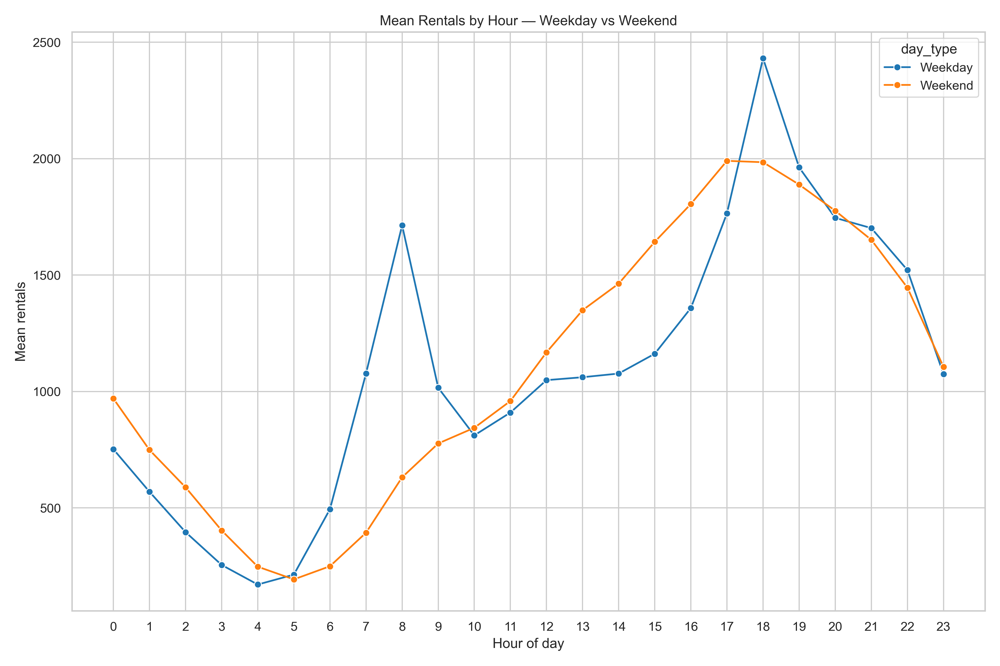
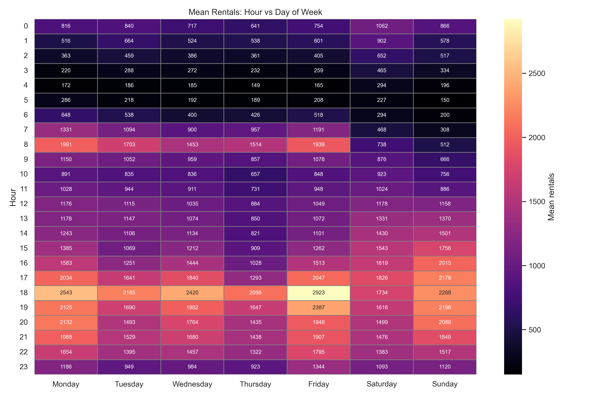
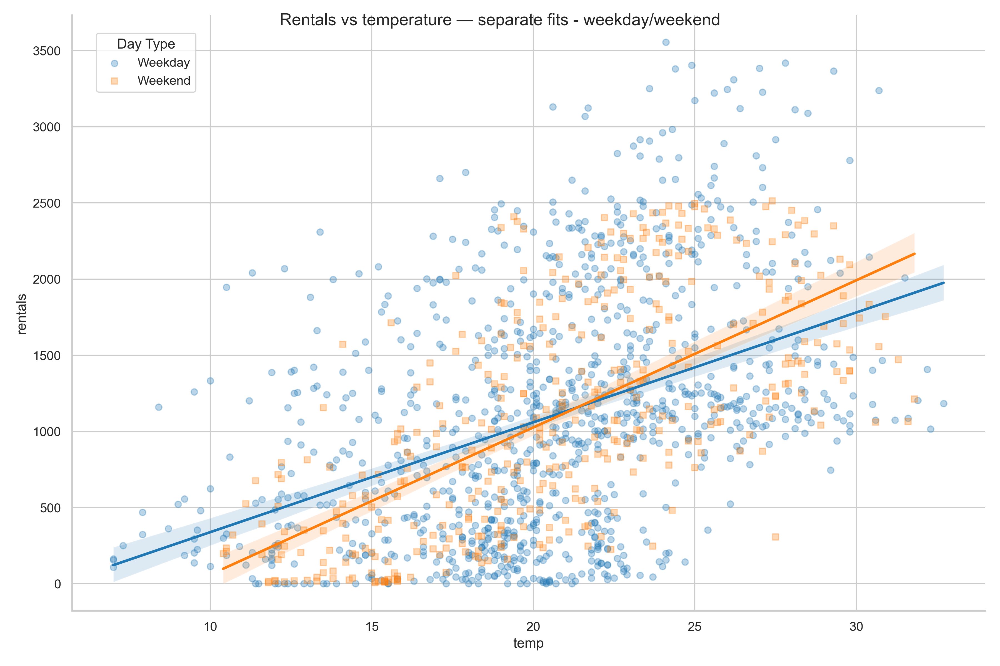
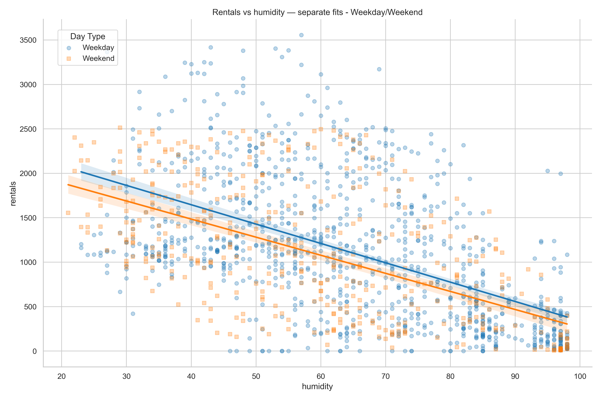

# 🚴 Weather Sensitivity and Bike-Sharing Demand
## Evidence from Weekday–Weekend Interactions in Seoul

> **Does weather affect bike-sharing demand differently depending on *why* you're riding?**

I'm an avid Lime user in London. I noticed I always check the weather before a weekend ride — but rarely before cycling to uni on a weekday. That small personal observation became the research question behind this project.

Using Seoul's public bike-sharing data, I tested whether weather sensitivity varies between weekday commuters and weekend recreational users — and found that it does, in ways that have real operational implications for micromobility operators.

---

## 📊 Key Findings

| Weather Variable | Weekday Effect | Weekend Effect | Statistically Significant? |
|---|---|---|---|
| Temperature (+1°C) | +44 rentals/hr | +69 rentals/hr | ✅ Yes (p = 0.003) |
| Humidity (+1%) | −15 rentals/hr | −10 rentals/hr | ✅ Yes (p = 0.027) |
| Rainfall (log) | −306 rentals/unit | −260 rentals/unit | ❌ No (p = 0.709) |

**In plain English:**
- 🌡️ **Temperature**: Weekend recreational cyclists are ~57% more temperature-sensitive than weekday commuters. Leisure riders wait for a nice day; commuters don't have that luxury.
- 💧 **Humidity**: Humidity deters weekday users more strongly — commuters facing discomfort have fewer alternatives than leisure riders who can simply stay home.
- 🌧️ **Rainfall**: Rain is a universal deterrent. Regardless of trip purpose, heavy rain suppresses demand equally across day types.

---

## 💼 Business Implications

These behavioural differences are actionable for operators like Lime, TfL, or Forest:

- **Dynamic pricing**: Implement temperature-based surge pricing on warm weekends, when recreational demand is most elastic
- **Fleet rebalancing**: Reduce weekend rebalancing operations during poor weather — recreational demand drops sharply; don't waste resources repositioning bikes
- **Demand forecasting**: Regime-aware models (segmented by day type) outperform aggregate weather models — trip purpose fundamentally shapes weather response

---

## 🔧 Methodology

- **Data**: Seoul Public Bike Sharing dataset (UC Irvine ML Repository), May–June 2018
- **Observations**: 1,447 hourly rental records (1,042 weekday, 405 weekend) after cleaning
- **Model**: OLS multiple regression with interaction terms (`statsmodels`)
- **Key variables**: Temperature (°C), Humidity (%), log-transformed Rainfall (mm), `is_weekend` binary indicator
- **Diagnostics**: VIF checks confirmed no multicollinearity (all VIF < 2); log transformation applied to correct right-skewed rainfall distribution
- **Tools**: Python — `pandas`, `numpy`, `statsmodels`, `scipy`, `matplotlib`, `seaborn`

**Model performance**: Adjusted R² = 0.390, F-statistic p < 6.31e-151

---

## 📁 Repository Structure

```
seoul-bike-weather-analysis/
├── data/
│   ├── seoul.csv                 # Raw dataset
│   └── seoul_processed.py        # Processed dataset 
├── src/
│   ├── prep-processing.py         # Data cleaning & feature engineering
│   └── analysis.py                # EDA, regression, hypothesis testing
├── imgs/
│   └── selected/                   # Selected visualisations
├── results/                       # Linear regression results, CSV files
├── README.md
├── requirements.txt
└── .gitignore
```

---

## 🚀 Reproduce This Analysis

```bash
git clone https://github.com/FD2906/seoul-bikesharing.git
cd seoul-bikesharing
pip install -r requirements.txt
python src/prep-process.py
python src/analysis.py
```

---

## 📈 Selected Visualisations

**Figure 2 — Hourly demand profiles by day type**
Weekdays show sharp bimodal commute peaks at 08:00 and 18:00; weekends show a flatter, leisure-driven distribution peaking mid-afternoon.



---

**Figure 3 — Demand heatmap by day and hour**
Highest aggregate demand occurs on weekday evenings, particularly Monday–Friday from 17:00–20:00. Weekend mornings (07:00–09:00) show notably lower activity compared to their weekday counterparts.



---

**Figure 4 — Temperature vs. rentals by day type**
Diverging slopes confirm differential temperature sensitivity — weekend demand rises more steeply with temperature, consistent with recreational cyclists selecting for comfort.



---

**Figure 5 — Humidity vs. rentals by day type**
Near-parallel slopes indicate humidity's deterrent effect is broadly uniform across day types, with weekdays showing marginally steeper suppression.



---

## ⚠️ Limitations

- **Temporal scope**: May–June 2018 only — findings reflect early summer behaviour and may not generalise to winter or autumn patterns
- **Geographic aggregation**: City-wide weather data from a single station; station-level microclimate effects are not captured
- **Unexplained variance**: Adjusted R² of 0.39 leaves ~61% of rental variance unaccounted for — air quality, special events, and supply constraints are likely contributors
- **2018 context**: Post-pandemic remote work patterns may have shifted the weekday/weekend commute dynamic

---

## 📚 References

- Kim, K. (2023). Discovering Spatiotemporal Usage Patterns of a bike-sharing System by Type of pass. *Transportation*
- Kinoshita, S., Bando, Y. and Sayama, H. (2024). Spatio-Temporal Differences in Bike Sharing Usage. *ArXiv (Cornell University)*
- V.E., S. and Cho, Y. (2020). A rule-based Model for Seoul Bike Sharing Demand Prediction Using Weather Data. *European Journal of Remote Sensing*
- Pennsylvania State University (2018). *10.7 - Detecting Multicollinearity Using Variance Inflation Factors | STAT 462*

---

## 👤 About

Built by **Frank Dong** as part of statistics coursework at UCL (Grade: 74/100 — First Class).

Motivated by a genuine interest in urban micromobility data and operations.

**Connect:** [LinkedIn](https://linkedin.com/in/-frank-dong-) | [frank.dong.24@ucl.ac.uk](mailto:frank.dong.24@ucl.ac.uk)
